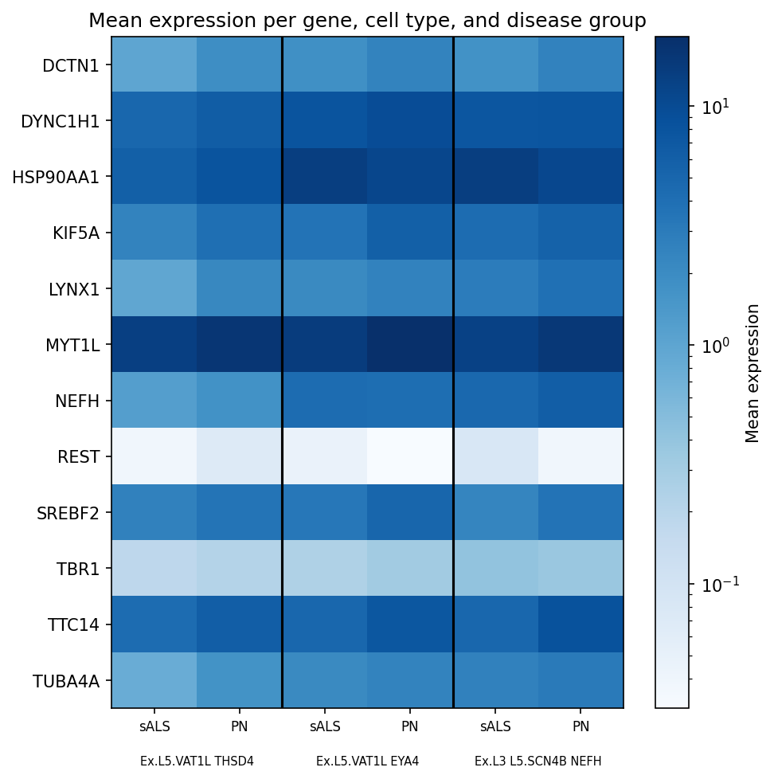
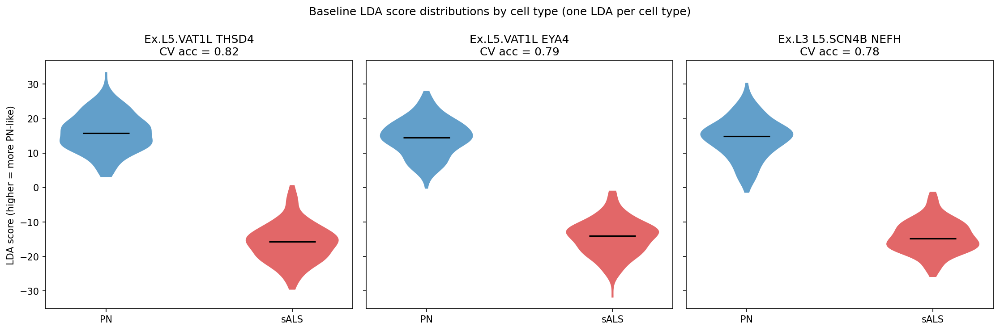
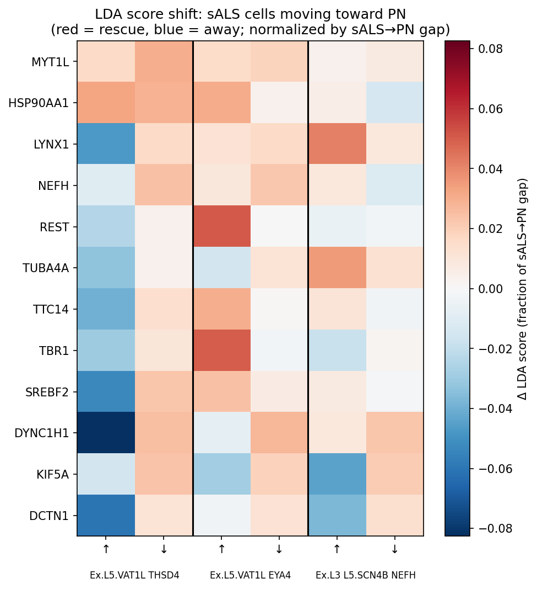
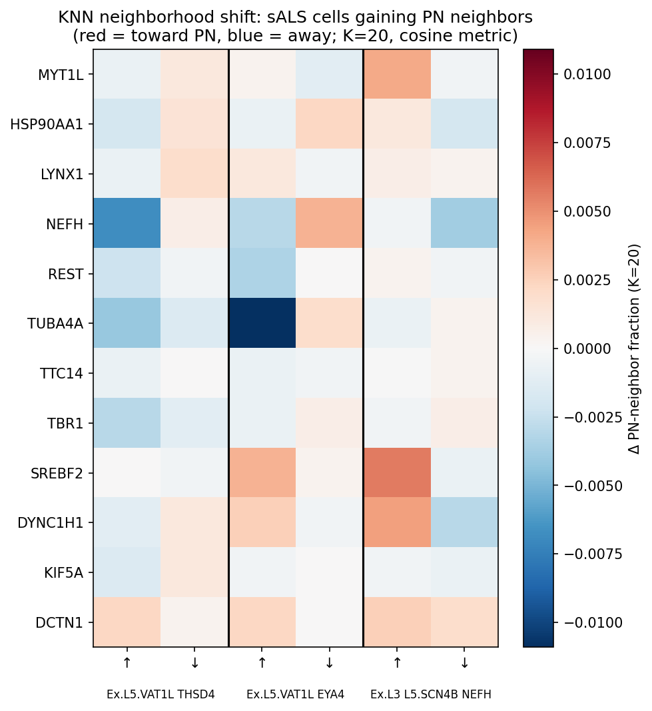
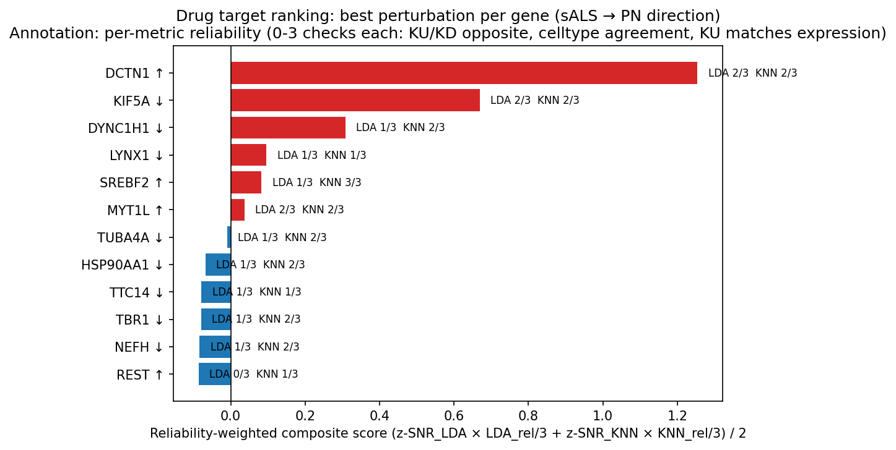
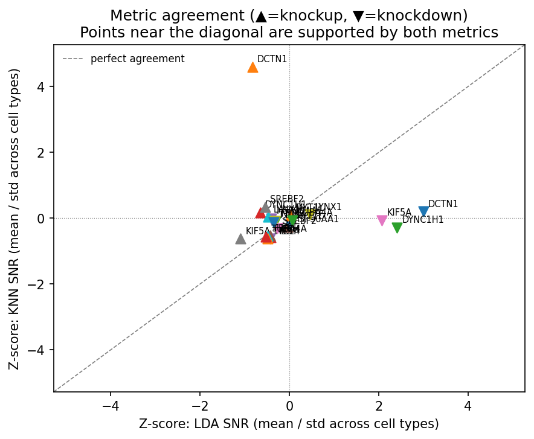

# ALS In-Silico Perturbation Analysis

Coding challenge submission for Helical. An in-silico perturbation workflow applied to ALS-specific genes, embedded with GeneFormer and interpreted in the resulting latent space.

---

## Installation

Requires Python ≥ 3.12.

```bash
git clone https://github.com/tobiaszehnder/als-perturb.git
cd als-perturb

# with uv (recommended)
uv sync

# or with pip
pip install -e .
```

The dataset (~500 MB) is downloaded automatically on first run. The GeneFormer model weights are fetched from HuggingFace on first use via the `helical` library.

---

## Dataset & model

- **Dataset**: Single-nucleus RNA-seq from primary motor cortex (BA4) of sALS patients and healthy controls (Pineda et al. 2024, [GSE174332](https://www.ncbi.nlm.nih.gov/geo/query/acc.cgi?acc=GSE174332))
- **Model**: GeneFormer V2 (`gf-12L-95M-i4096`), a 12-layer, 95M-parameter transformer pretrained on ~30M single-cell transcriptomes, producing 512-dimensional cell embeddings

---

## Task 1: In-Silico Perturbation Workflow

GeneFormer tokenizes cells by rank-ordering genes by expression. The perturbation strategy exploits this directly by modifying raw counts in `.X` before embedding, so no model retraining is required.

| Perturbation | Operation | Effect on rank |
|---|---|---|
| **Knock-down** | Set expression to 0 | Gene moves to bottom of ranking |
| **Knock-up** | Set expression to per-cell max + 1 | Gene moves to top of ranking |

The workflow is implemented in [`src/perturbation.py`](src/perturbation.py) and demonstrated in [`notebooks/task1.ipynb`](notebooks/task1.ipynb).

---

## Task 2: Perturbations on ALS-Specific Genes

### Gene selection

12 genes were selected from Pineda et al. (2024) based on their role in transcriptional divergence between sALS and healthy upper motor neurons:

| Category | Genes |
|---|---|
| Predicted master regulators of L5 VAT1L+ DEGs | `MYT1L`, `REST`, `SREBF2` |
| Top transcriptome-wide divergence (TxD) drivers | `LYNX1`, `TBR1` |
| ALS-linked axonal/structural genes correlated with TxD | `KIF5A`, `DCTN1`, `DYNC1H1`, `TUBA4A` |
| Highly specific DEGs in MCX L5 neurons | `NEFH`, `TTC14`, `HSP90AA1` |

### Cell type selection

Three excitatory neuron subtypes with the largest transcriptomic divergence between sALS and PN in the MCX (Pineda et al. Fig. 4C):
- `Ex.L5.VAT1L_THSD4`
- `Ex.L5.VAT1L_EYA4`
- `Ex.L3_L5.SCN4B_NEFH`

These L5 corticospinal projection neurons are the primary site of upper motor neuron degeneration in ALS.

Each gene was perturbed in both directions (knock-up and knock-down) across a balanced sample of 150 sALS and 150 PN cells per cell type, for a total of 25 embedding runs (1 baseline + 24 perturbations).

---

## Task 3: Interpreting the Embedding Space

### Plot 0: Gene expression reference

Before measuring perturbation effects, we confirm the expression context for each target gene:



Mean expression per gene, cell type, and disease group (log scale, Blues colormap). This is the reference for direction checks: a gene more highly expressed in PN than sALS should, under a simple rank-shift model, show a positive rescue shift after knockup and a negative shift after knockdown.

---

### Part 1: Disease state is linearly encoded

The first question is whether sALS and PN cells are distinguishable in the GeneFormer embedding at all. A linear discriminant analysis (LDA) fit per cell type with 5-fold cross-validation gives a clear answer:



CV accuracy is ~78% across cell types, well above chance. The violin plots confirm that the LDA axis cleanly separates sALS (red) from PN (blue) within each cell type. This is a key finding: GeneFormer, without any disease-specific fine-tuning, encodes disease state as a linearly separable direction in its 512-dimensional embedding space.

This result is not visible in UMAP or silhouette scores (both show heavy overlap), because those methods collapse high-dimensional geometry and miss signals distributed across many dimensions jointly. LDA uses all 512 dimensions and finds the optimal separating direction.

---

### Part 2: LDA shift after perturbation

For each of the 24 perturbations (12 genes × knockup/knockdown) we apply the fixed baseline LDA to the perturbed sALS cell embeddings and measure the change in mean score, normalized by the baseline sALS to PN gap:



All shifts are in the low percentages of the sALS to PN gap. Four observations confirm these are likely not meaningful rescue signals:

1. **Effect sizes are negligible.** No perturbation substantially closes the gap between sALS and PN.
2. **No consistency across cell types.** Many genes change sign between the three cell types, inconsistent with a universal mechanism.
3. **Knockup and knockdown often shift in the same direction.** A genuine linear gene-dose effect would produce opposite shifts for the two directions.
4. **Directions contradict expression differences.** Most target genes are expressed more in PN than sALS, so knockup should rescue and knockdown should worsen. This expectation is met for fewer than half the genes, consistent with noise rather than a gene-level signal.

---

### Part 3: KNN neighborhood shift

As a local, non-linear complement to the LDA metric, we measure the change in each sALS cell's fraction of PN neighbors (K=20, cosine metric, fixed baseline graph):



The same four reliability problems are present: tiny effects, no cross-celltype consistency, KU/KD often agree, and directions contradict expression expectations. The two metrics largely disagree with each other as well, confirming both are operating at the noise floor.

---

### Reliability table

For each gene, three binary checks are applied independently to LDA and KNN, giving a per-metric reliability score (0-3):

| Check | What it tests |
|---|---|
| KU/KD opposite | KU and KD produce opposite-sign shifts (gene-dose coherence) |
| KU celltype agree | KU shift has the same sign in all three cell types |
| KU exp=obs | KU direction matches expectation from expression differences |

No gene passes all three checks on both metrics. The widespread failures are consistent with a null result: the signals do not have the internal structure expected from a real biological effect.

---

### Why single-gene perturbations fail

The null result is informative. Two compounding reasons explain it:

**GeneFormer encodes global transcriptional state, not individual genes.** A single-gene rank perturbation is a tiny change to a 22,000-gene rank ordering. The model is robust to small local changes by design, having been trained to generalize across expression variability.

**ALS transcriptional divergence is a network-level phenomenon.** The gap between sALS and PN reflects the cumulative effect of hundreds of genes and their regulatory interactions, not any single gene. In vivo, perturbing a transcription factor like MYT1L would trigger a cascade of downstream expression changes. The rank-shift approach captures only the direct effect on one gene's position in the ordering, missing the cascade entirely.

This means the disease axis exists and is detectable (Part 1), but reaching the other side of it requires moving the entire transcriptional program, not one gene at a time.

---

## Task 4: Drug Target Prioritization

Given the weak signals, a composite score is built per (gene, direction) that rewards large effect size and cross-celltype consistency. For each metric, the mean shift across the three cell types is divided by the standard deviation (SNR). The two SNRs are z-scored to equalize scale, then each is weighted by its per-metric reliability before being averaged:

    composite = (z_SNR_LDA × LDA_reliability/3 + z_SNR_KNN × KNN_reliability/3) / 2

A gene that passes none of a metric's three reliability checks contributes nothing from that metric to its composite score. The best perturbation direction per gene is selected and genes are ranked by composite score.

### Ranking



Each bar is annotated with the per-metric reliability (LDA x/3, KNN x/3). Red bars indicate net positive composite scores; blue indicates zero or negative. The ranking is exploratory and should not be treated as a confident prediction of rescue efficacy.

### Metric agreement



Each point is a (gene, direction) pair. Points near the dashed diagonal are supported by both LDA and KNN. The scatter across all four quadrants, with no clear diagonal clustering, confirms that the two metrics are largely independent at this noise level.

---

## Conclusion & limitations

The central finding is a productive tension: **the disease axis exists and is clearly detectable via LDA (~78% CV accuracy), but single-gene rank perturbations produce no detectable movement along it.**

This is a meaningful result that reveals the scale mismatch between the perturbation strategy (shifting one gene's rank) and the biological phenomenon being targeted (a transcriptome-wide divergence driven by network-level regulatory changes).

**What would help:**

1. **Multi-gene perturbations along the LDA axis.** Simultaneously perturbing the top 10-50 LDA-weighted genes would produce a much stronger input signal than any single gene. This is straightforward to implement with the existing workflow.

2. **Perturbation-aware models.** Tools like GEARS (trained on Perturb-seq data), scGPT, or CellOracle (GRN-based cascade simulation) are designed to predict transcriptional cascades, not just re-embed a manually edited expression profile. They would produce biologically realistic post-perturbation expression states as input to the LDA analysis.

3. **Disease-state fine-tuning.** Adding a classification head on top of frozen GeneFormer and fine-tuning on the sALS/PN labels would reshape the latent space so that the disease axis becomes a primary direction of variation, potentially amplifying perturbation signals.

The perturbation workflow, LDA disease axis, and composite scoring framework built here are directly reusable for any of these extensions.
