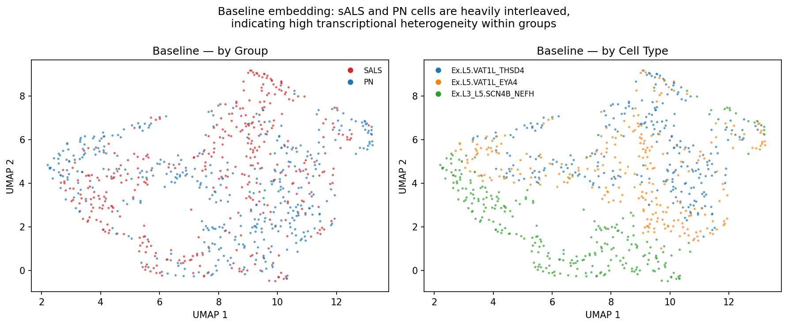
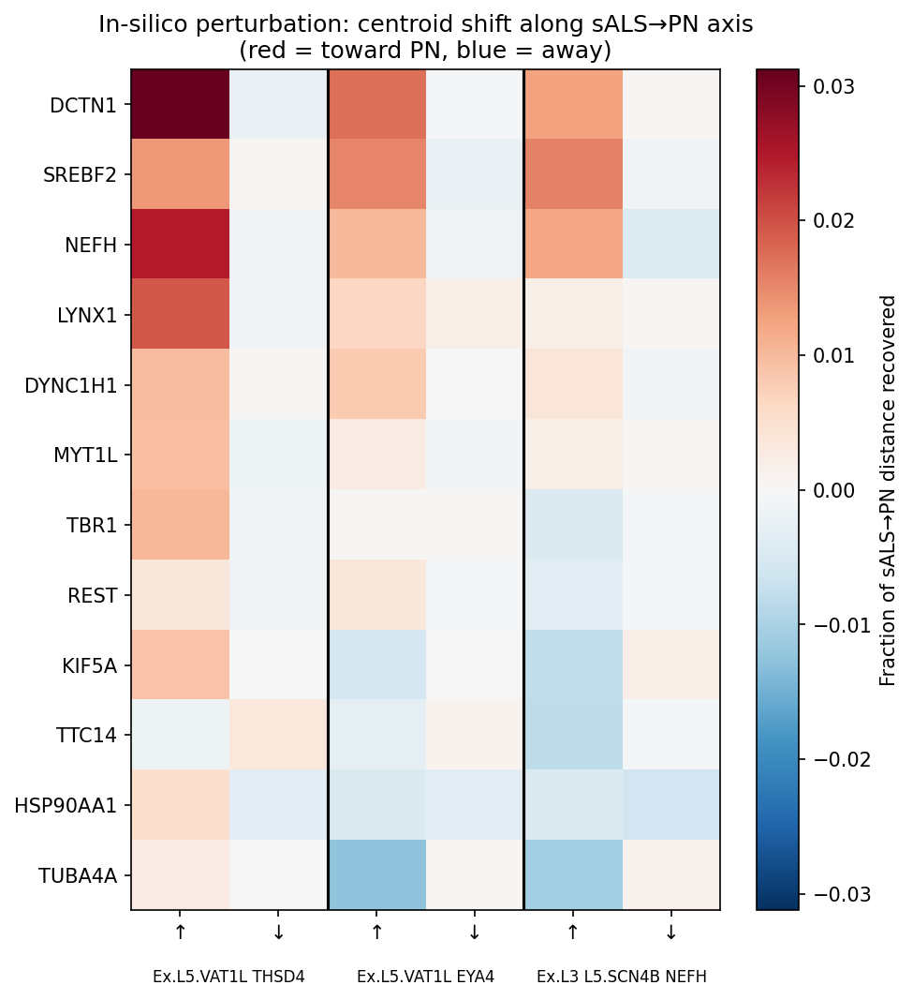
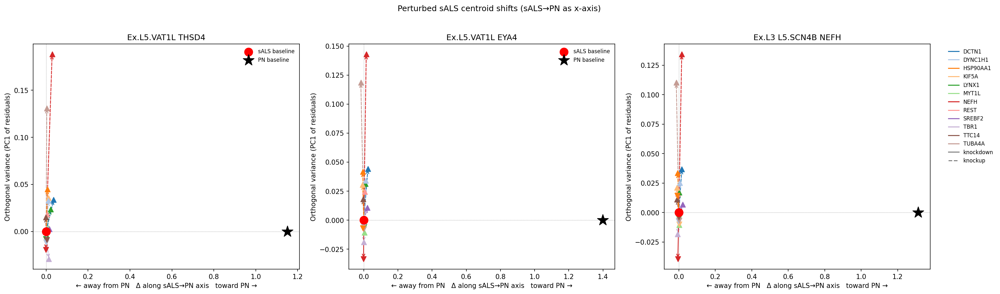
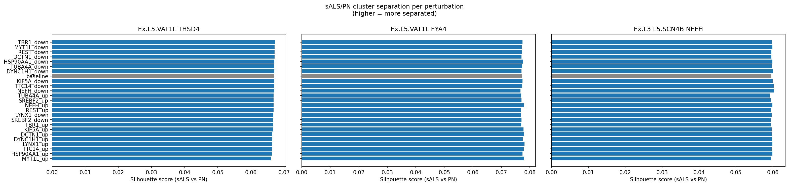
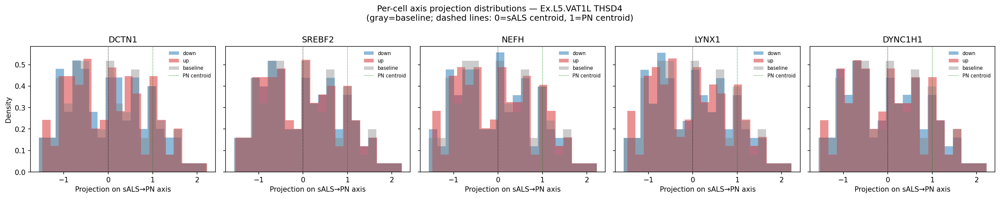

# ALS In-Silico Perturbation Analysis

Coding challenge submission for Helical. An in-silico perturbation workflow applied to ALS-specific genes, embedded with GeneFormer and interpreted in the resulting latent space.

---

## Installation

Requires Python ≥ 3.12.

```bash
git clone https://github.com/tobiaszehnder/als-perturb.git
cd als-perturb

# with uv (recommended)
uv sync

# or with pip
pip install -e .
```

The dataset (~500 MB) is downloaded automatically on first run. The GeneFormer model weights are fetched from HuggingFace on first use via the `helical` library.

---

## Dataset & model

- **Dataset**: Single-nucleus RNA-seq from primary motor cortex (BA4) of sALS patients and healthy controls (Pineda et al. 2024, [GSE174332](https://www.ncbi.nlm.nih.gov/geo/query/acc.cgi?acc=GSE174332))
- **Model**: GeneFormer V2 (`gf-12L-95M-i4096`) — a 12-layer, 95M-parameter transformer pretrained on ~30M single-cell transcriptomes, producing 512-dimensional cell embeddings

---

## Task 1: In-Silico Perturbation Workflow

GeneFormer tokenizes cells by rank-ordering genes by expression. The perturbation strategy exploits this directly by modifying raw counts in `.X` before embedding — no model retraining required.

| Perturbation | Operation | Effect on rank |
|---|---|---|
| **Knock-down** | Set expression → 0 | Gene moves to bottom of ranking |
| **Knock-up** | Set expression → per-cell max + 1 | Gene moves to top of ranking |

The workflow is implemented in [`src/perturbation.py`](src/perturbation.py) and demonstrated in [`notebooks/task1.ipynb`](notebooks/task1.ipynb).

---

## Task 2: Perturbations on ALS-Specific Genes

### Gene selection

12 genes were selected from Pineda et al. (2024) based on their role in transcriptional divergence between sALS and healthy upper motor neurons:

| Category | Genes |
|---|---|
| Predicted master regulators of L5 VAT1L+ DEGs | `MYT1L`, `REST`, `SREBF2` |
| Top transcriptome-wide divergence (TxD) drivers | `LYNX1`, `TBR1` |
| ALS-linked axonal/structural genes correlated with TxD | `KIF5A`, `DCTN1`, `DYNC1H1`, `TUBA4A` |
| Highly specific DEGs in MCX L5 neurons | `NEFH`, `TTC14`, `HSP90AA1` |

### Cell type selection

Three excitatory neuron subtypes with the largest transcriptomic divergence between sALS and PN in the MCX (Pineda et al. Fig. 4C):
- `Ex.L5.VAT1L_THSD4`
- `Ex.L5.VAT1L_EYA4`
- `Ex.L3_L5.SCN4B_NEFH`

These L5 corticospinal projection neurons are the primary site of upper motor neuron degeneration in ALS.

Each gene was perturbed in both directions (knock-up and knock-down) across a balanced sample of 150 sALS and 150 PN cells per cell type, for a total of 25 embedding runs (1 baseline + 24 perturbations).

---

## Task 3: Interpreting the Embedding Space

### Baseline UMAP

The first diagnostic: are sALS and PN cells separable in the GeneFormer embedding?



The left panel shows heavy interleaving of sALS (red) and PN (blue) cells. The right panel confirms that cell type is well-encoded — the three motor neuron subtypes form distinct regions. GeneFormer is functioning as intended; it simply was not pre-trained to resolve disease state. This sets the context for all downstream analysis: any perturbation effect must compete against high within-group variance.

---

### Centroid shift along the sALS→PN axis

For each perturbation, we project the shift of the perturbed sALS centroid onto the sALS→PN disease axis, normalised by the total centroid distance. A score of +1 would mean the perturbed cells fully reached the PN centroid.



All values are ≤ 3% of the axis length. No perturbation produces a detectable centroid shift.

---

### Structured 2D centroid projection

The same shifts rendered as arrows. The x-axis is the sALS→PN disease axis; the y-axis is the largest orthogonal direction of variation across all perturbation centroids (PC1 of the residuals).



All arrows are clustered near the origin, confirming that perturbation effects are small in both the disease direction and orthogonally.

---

### Silhouette score per perturbation

If a perturbation were rescuing sALS cells, the sALS/PN clusters should become harder to separate (lower silhouette score).



All perturbations produce silhouette scores essentially identical to the baseline (~0.06–0.08). No perturbation changes the global cluster structure.

---

### KNN neighborhood shift

For each sALS cell, we measure the fraction of its K=20 nearest neighbors that are PN cells, and compute the delta vs. baseline. A positive delta means sALS cells moved into a more PN-like local neighborhood.


Shifts are small and inconsistent across cell types. Notably, the top genes here do not agree with the centroid shift plot — both metrics are operating near the noise floor.

---

### Per-cell axis projection distributions

Rather than just the centroid, we show the full distribution of individual sALS cell projections onto the disease axis (top-5 genes by mean absolute projection).



The x-axis is normalized so x=0 = sALS centroid, x=1 = PN centroid. Individual cells span roughly −1.5 to +2.5 — a range 3–4× wider than the entire sALS→PN axis. This makes the signal-to-noise problem concrete: a successful rescue perturbation would need to shift the entire population distribution rightward, not just nudge the mean.

---

## Task 4: Drug Target Prioritization

Given the weak signals above, we aggregate two complementary metrics into a composite rescue score: centroid axis projection and KNN neighborhood shift, both z-scored and averaged across cell types. For each gene, the best-performing perturbation direction is reported.

### Ranking


`DCTN1↑`, `SREBF2↑`, and `LYNX1↑` emerge as the top candidates. The ranking should be treated as an exploratory hypothesis rather than a confident prediction.

### Metric agreement


Points near the dashed diagonal are supported by both metrics. The scatter across all four quadrants confirms that the two metrics are largely independent — consistent with both measuring noise rather than a true biological signal.

---

## Conclusion & limitations

All three analysis metrics converge on a null result: no perturbation produces a detectable shift of sALS cells toward the PN state in the GeneFormer embedding space.

This is most likely a **measurement resolution problem**, not a biological null. GeneFormer was pre-trained to encode cell *type* identity, not disease state. The sALS→PN centroid distance is small relative to within-group variance (silhouette ≈ 0.07), so perturbation effects — even if biologically real — are undetectable against this background.

The natural next step is **disease-state fine-tuning**: adding a classification head (sALS vs. PN) on top of the frozen GeneFormer weights and fine-tuning on the labelled cells in this dataset. This would reshape the latent space so that the disease axis becomes a primary direction of variation, making centroid shifts and neighborhood analysis meaningful. The same perturbation workflow applied to fine-tuned embeddings could reveal genuine rescue candidates from the 12 genes analysed here.
